# Android Apk 瘦身

### 1、在打包的时候将图片转换成 `webp`

    classpath 'com.dongnao.optimizer:optimizer-picture:2.0.0'
    apply plugin: 'com.dongnao.optimizer'

    1.1:
        buildscript {
            repositories {
                google()
                jcenter()
            }
            dependencies {
                classpath 'com.android.tools.build:gradle:3.0.0'
                classpath 'com.dongnao.optimizer:optimizer-picture:2.0.0'
            }
        }

     1.2:
        apply plugin: 'com.android.application'
        apply plugin: 'com.dongnao.optimizer'

### 2、资源打包配置:resource.asrc

由于第三方库，如appcompat-v7的引入，库中包含了大量的国际化资源，根据情况通过配置删除。

    defaultConfig {
            versionName "1.0"
            // 只保留默认的和英文
            resConfigs 'en'
        }

### 3、动态库打包配置

如果项目中包含第三方SDK或者自己使用了ndk，如果不进行配置会打包全cpu架构的动态库进入apk.。对于真机，只需要保留一个armeabi(armeabi-v7a)就可以了，所以可修改配置

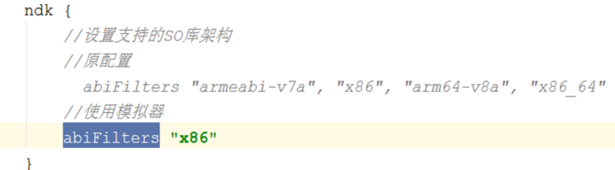

### 4、移除无用资源

##### 4.1：一键移除,如果出现使用动态id使用资源会出现问题(**不建议**)

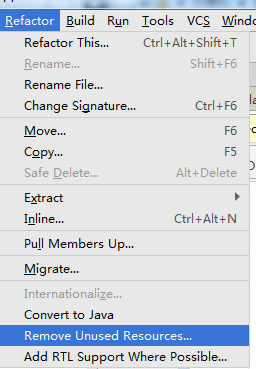

动态获取资源id,未直接使用R.xx.xx ，则这个id代表的资源会被认为没有使用过(类似不能混淆反射类)

动态获取资源id:

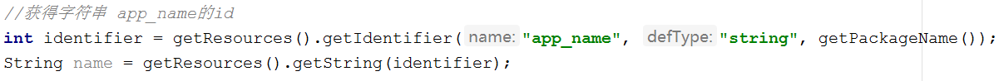

##### 4.2：使用Lint检查,检查出的无用资源，自行进行排查手动删除

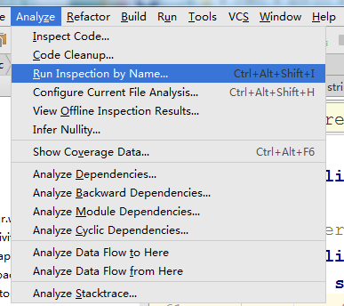

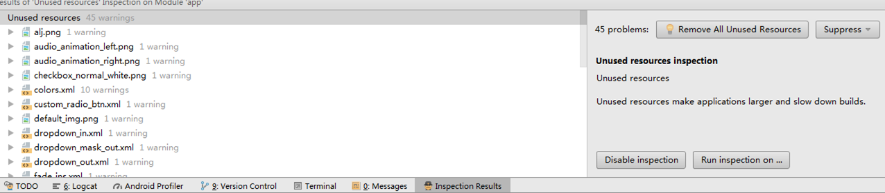

### 5、开启Proguard

进行压缩（Shrink）,优化（Optimize）,混淆（Obfuscate）,预检（Preveirfy）。

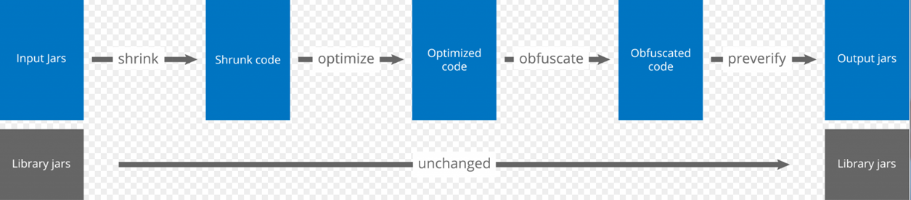

    1. 压缩（Shrink）:在压缩处理这一步中，用于检测和删除没有使用的类，字段，方法和属性。
    2. 优化（Optimize）:在优化处理这一步中，对字节码进行优化，并且移除无用指令。
    3. 混淆（Obfuscate）:在混淆处理这一步中，使用a,b,c等无意义的名称，对类，字段和方法进行重命名。
    4. 预检（Preveirfy）:在预检这一步中，主要是在Java平台上对处理后的代码进行预检。

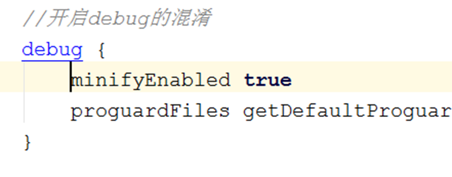

仿微信使用较低版本的android gradle插件，遇到一个错误，先 `clean` 再 `make`

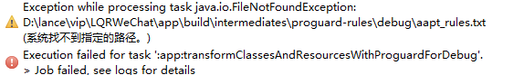

### 6、启用资源缩减

移除app中未使用的资源，包括代码库中未使用的资源。
只与代码压缩协同工作，未使用的代码被移除，任何不再被引用的资源也会被移除。

https://developer.android.google.cn/studio/build/shrink-code.html#shrink-resources

### 7、资源混淆与7zip压缩

资源混淆配合7zip压缩，减小apk大小，增加破解难度(微信)

#### 7.1:资源混淆

##### 7.1.1:构建流程

https://developer.android.google.cn/studio/build/index.html?hl=zh-cn

R文件 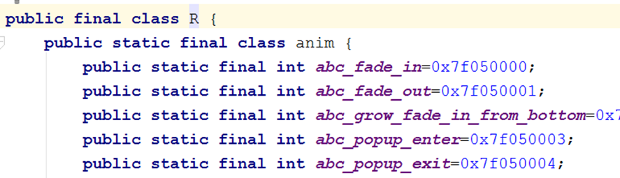

每个资源类型都有对应的 R子类（例如，R.anim 对应于所有动画资源），而该类型的每个资源都有对应的静态整型数（例如，R.anim.abc_fade_in）。这个整型数就是可用来检索资源的资源 ID。

    格式为：0xpptteeee（p代表的是package，t代表的是type，e代表的是entry）
    Package ID  包ID。系统为0x01，应用程序资源为0x7f。
    Type ID     资源的类型ID。资源的类型有animator、anim、color等等，每一种都会被赋予一个ID。
    Entry ID    资源在其所属的资源类型中所出现的次序。

##### 7.1.2:AAPT

Android Asset Packaging Tool
apk中的manifest、bitmap xml 、layout xml等等这些资源全是二进制的。由aapt进行编译后的资源

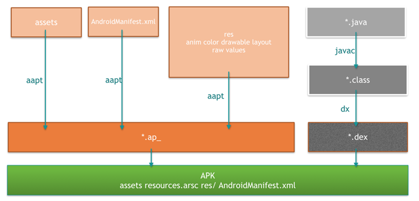

    1、把"assets"和"res/raw"目录下的所有资源进行打包（根据不同的文件后缀选择压缩或不压缩），而"res/"目录下的其他资源进行编译或者其他处理（具体处理方式视文件后缀不同而不同，例如：".xml"会编译成二进制文件）；
    2、对除了assets资源之外所有的资源赋予一个资源ID常量，并且会生成一个资源索引表resources.arsc；
    3、编译AndroidManifest.xml成二进制的XML文件；

##### 7.1.3:resource.arsc

提供资源ID到资源文件路径的映射关系，如 R.layout.activity_main（ID:0x7f030000）到res/layout/activity_main.xml的映射关系，应用开发过程中所使用的资源ID使用0x7f030000查找资源。

android通过AssetManager和Resources获得一个图片或者xml等资源。其中，Resources类可以根据ID来查找资源，而AssetManager类根据文件名来查找资源。Resources类先根据ID来找到资源文件名称，然后再将该文件名称交给AssetManager类通过查找arsc文件(资源映射文件)来打开对应的文件的。

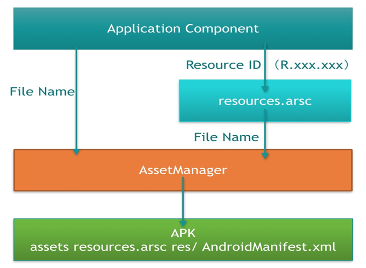

混淆就是修改映射表(arsc文件)

    通过arsc文件格式，混淆步骤为：
    1、解析arsc文件(主要为全局与资源名字符串池)
    2、修改字符串池中字符串(以无意义的a/b替换)
    3、修改apk中res目录资源文件名
    4、打包(7zip)、对齐、签名

解析参考资料：
https://github.com/google/android-arscblamer
格式参考资料：
http://androidxref.com/6.0.1_r10/xref/frameworks/base/include/androidfw/ResourceTypes.h

## 运行工程需要配置 7z、apksigner、zipalign环境变量

### 混淆工程扩展

	白名单配置
	mapping文件生成
	......

进一步减小apk大小：
	v1/v2签名？
https://source.android.com/security/apksigning/
	全版本允许：  只使用 v1 方案
	全版本允许：  同时使用 v1 和 v2 方案
	>=7.0版本：	只使用 v2 方案

	使用v1签名会在 META-INF/生成签名校验文件
	使用v2签名会向zip文件按照格式插入字节数据
	同时使用两种签名会增加两份数据(文件+数据),提供配置v1/v2签名开关
	v1签名：
		jarsigner.jar
https://docs.oracle.com/javase/6/docs/technotes/tools/windows/jarsigner.html